## Lab Report Week 1
*Vasilii Nikonov A15104557*

## Installing Visual Studio Code
Its is not diffuclut, trust me, just follow [instructions](https://code.visualstudio.com/) on official Visual Studio Code website. Make sure to choose the correct operation system. When you open it up, you should see something like this:
<br></br>
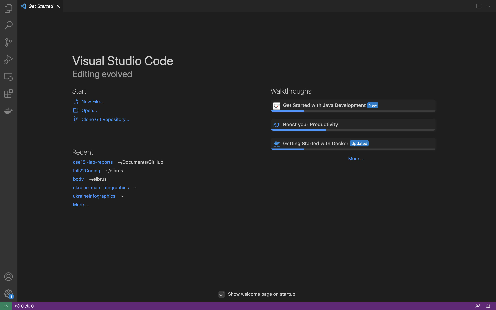
<br></br>
From the very begining I recommend to use the dark theme. Much easier on your eyes.

## Remotely Connecting
Open the terminal in VSCode, or any other terminal you prefer. Then write the following code:

```
ssh cs15lfa22zz@ieng.ucsd.edu
```
Then enter your password, and after that you will acess the remote server. You will use *Secure Remote Login and File Transfer* to control remote machine from your local.

**Make sure to write `cs15` instead of `cse15`**

You should see something like this:
<br></br>
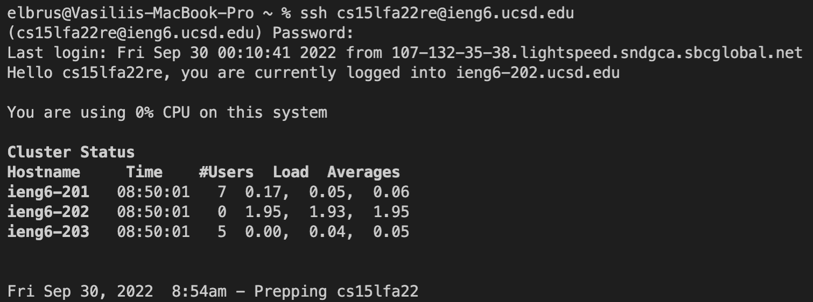
<br></br>

What you see will be different from what your peers see, because everybody connects at a different time. Within the cluster Users correcond to the # of people connected to a specific computer. For example I am the only one connected to 202. Load and Averages how extensively people use the cluster system.

## Trying Some Commands
I started with listing all the files in the directory with `ls`. 
This command also has oprions (flags) like:
| Option      | Meaning     |
| ----------- | ----------- |
| `-l`     | all files including hidden ones      |
| `-a`     | long names of files       |
| `-t`     | sort by time of modification       |
---

You can also combine all this flags into one command `ls -lat`
<br></br>
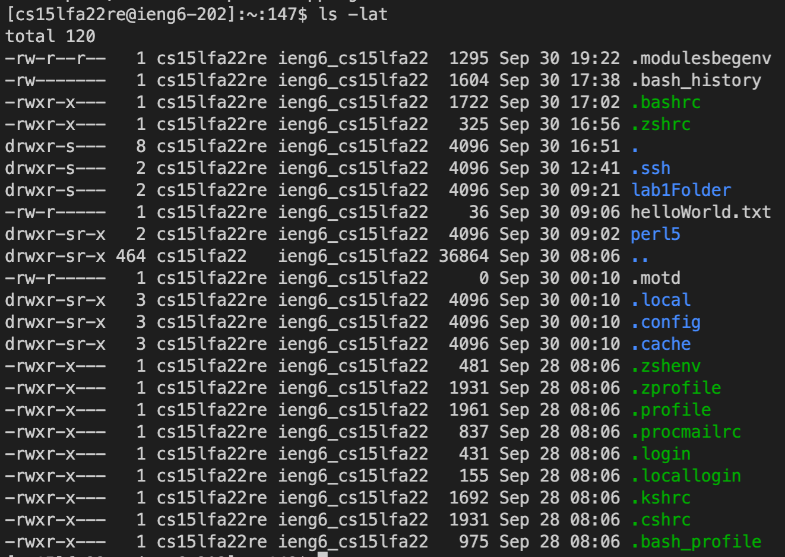
<br></br>
I also created a new directory, openned it and printed its absolute path, something useful for the fure where we will use `scp` to transfer files.
<br></br>
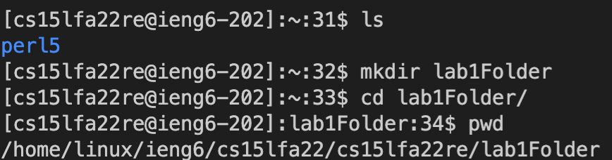
<br></br>
I also used result of the `pwd` command to copy a file and save it a different location with the command:
```
cp /home/linux/ieng6/cs15lfa22/cs15lfa22re/lab1Folder/helloWorld.txt ~/
```
With it I transfered the newwely created file to the home directory, and vertified it is the same file
<br></br>
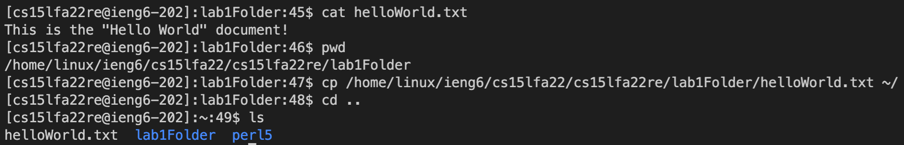
<br></br>

## Moving Files over SSH with scp

- We use `ssh` to connect to a remote server
- We use `scp` to securely transfer a copy from a local machine to a remote one.

I transfered `WhereAmI.java` from my laptop to ucsd server, specifing the directory. It was done for style purpuses. Each lab gets a separate directory. Then I connected to the remote server with `ssh` to vertify the file was added and at the correct place.
<br></br>
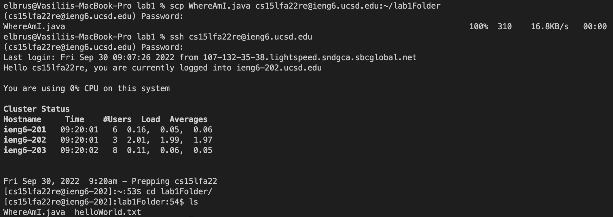
<br></br>
Running `WhereAmI` file locally and at the server produced different results, because of the environment the executable was running. Of course: home directory, current directory, and operation system name is different. I use mac, and the server uses linux, etc.

**Local Results**
<br></br>
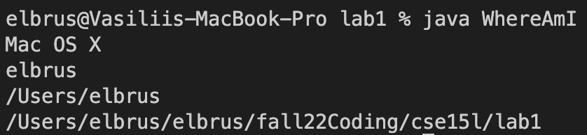
<br></br>

**Remote Results**
<br></br>
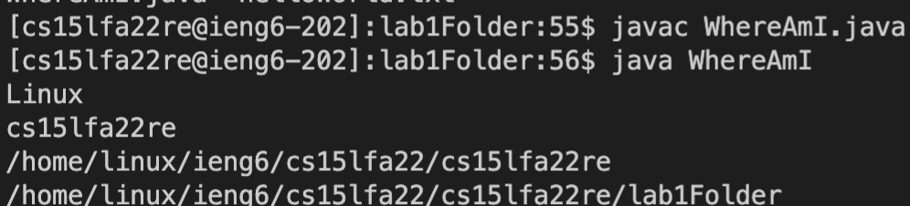
<br></br>
`getProperty` method reurns the current environment in which JVM runs.

It took me **70** seconds to make the change in `WhereAmI.java` and run the updated file remotely. Typing password and `cs15fa22` part takes up the most time.

## SSH Keys

As stated above: Tpping password is an extremely time consuming and repettitive exercise, so lets get rid of this formality. *Without sacrificing the security*

We will use `ssh-keygen` command to create both public and private key. Private key would stay localy, and Public key we will send to the remote server. This `ssh` would not ask us a question on the next log in attempt.
<br></br>
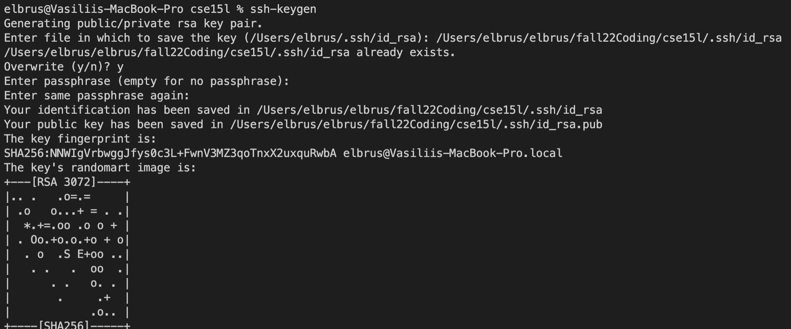
<br></br>
Initially I decided, that ssh key would stay inside the cse15l directory on my laptop to keep everything consistent, and because I has a pre existing ssh key in the home directory frrom previous coding experience. It didnt work that way, because ssh key has to be in the home directory. And I realised I can use SSH key multiple times, just ny sending public part to a resource. Thats exactly what I did.

**Log in without password**
<br></br>
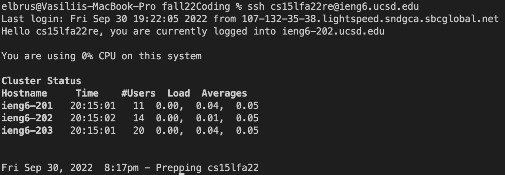
<br></br>
The time saving the changed file to actually running it remotely decreased from **70** to **50** seconds.

## Making Remote Running Even More Pleasant
First of all I spend to much time typing adress of the remote server. For that I did create a small zsh alias.
You can do so inside `~/.zshrc` (It is a hidden file, so it has a `.` symbal at the begining)
```
cs15c() {
    ssh cs15lfa22re@ieng6.ucsd.edu
}
```
Now I need to type just `cs15c` to connect (c at the end stand for connect). It is a simple command to remember, and barely takes a second to type.

**Connecting with `cs15c` command**
<br></br>
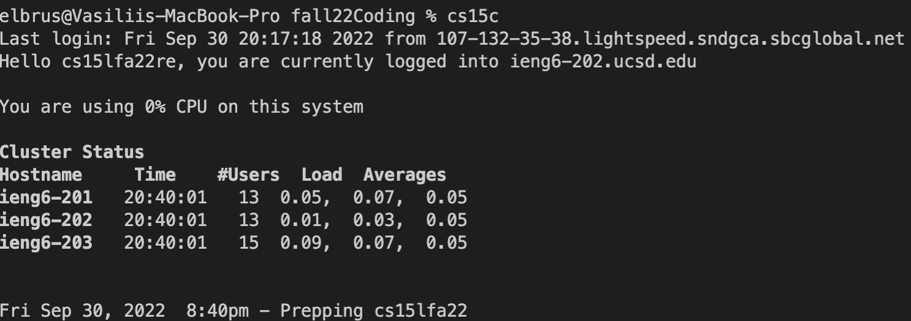
<br></br>

Then I noticed, that typing `scp` command takes a lot of time. So i rediced that to only
```
cs15 WhereAmI lab1Folder
```
by writting another small `zsh` script
```
cs15() {
  scp $1.java cs15lfa22re@ieng6.ucsd.edu:~/$2;
}
```
I can specify the name of the file to transfer, as well as the folder where I want to put it. This actually takes only 5 keystrokes, thanks to tab Autocomplete (Not counting # of strokes it takes to type the folder name, as it is "extra capability").
<br></br>
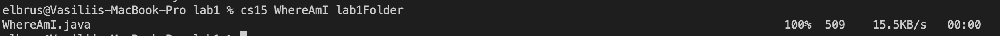
<br></br>

The total time from the edit in the file to actually running it remotely now takes less than 25 seconds, and most of the time I wait to connect to the server. If I open the second terminal, time is reduced to 10 seconds. & times better than the original time.
