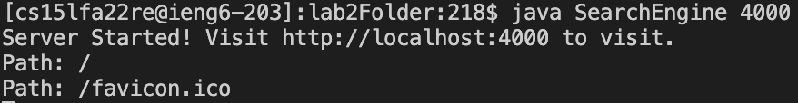
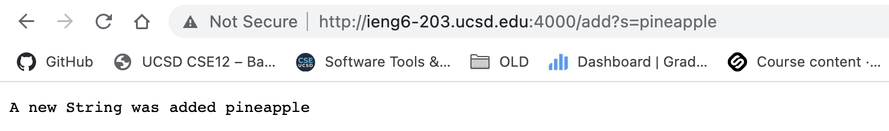
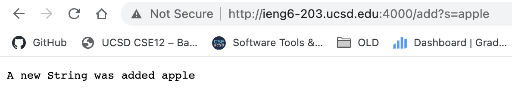
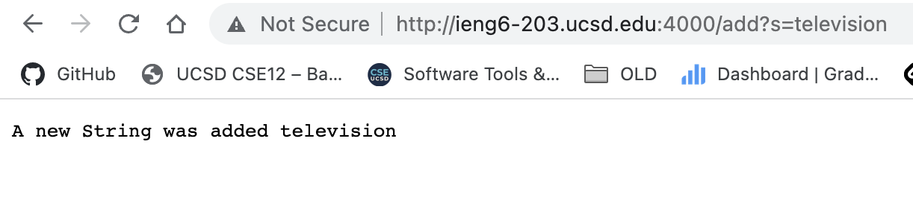
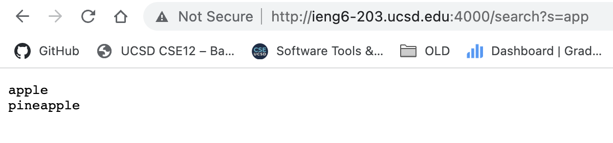
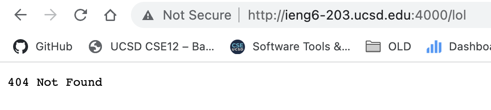
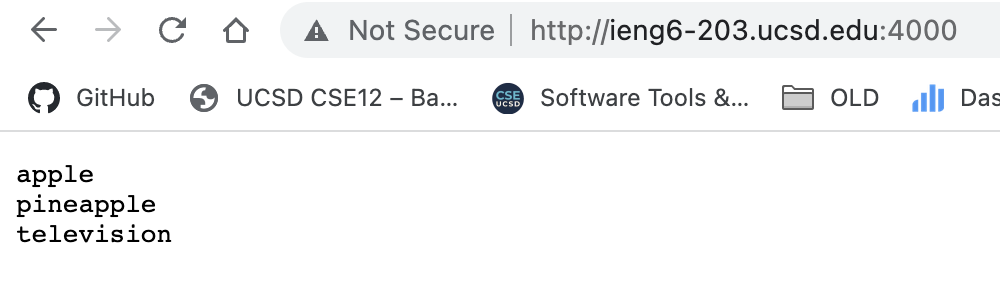
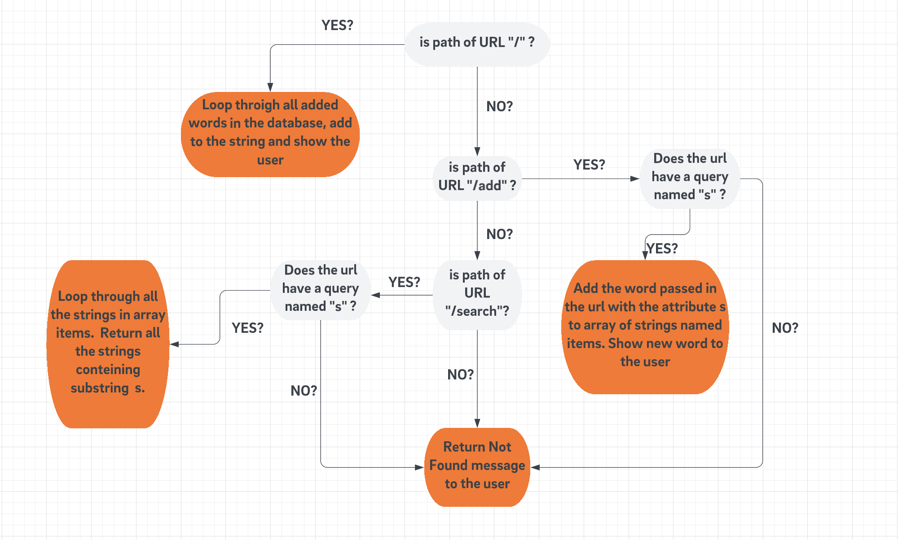
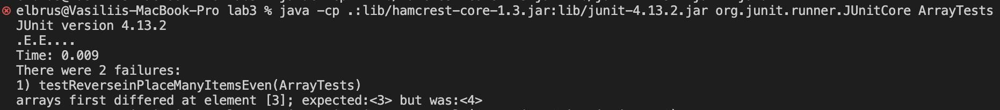
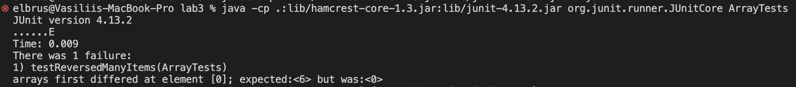

# Lab Report Week 3
*Vasilii Nikonov A15104557*

## Part 1 - Simplest Search Engine

I modified the Handler class to make it function like stated - being able to add strings and search for a substring match, using the browser search bar as the command input.

I deployed the server to ieng6 (ucsd system), so that it could be accessed from any computer, in contrast with dplohing the server locally. This was a tricky part, because to acess the url `http://ieng6-203.ucsd.edu:4000/` I had to use the UCSD VPN, otherwise the server was not loading.
\
\

*Starting server on port 4000*

I use the format  

- `/add?s=stringToAdd` with path `/add` and attribute `s` to add the String to my "search engine"
- `/search?s=stringToSearch` with path `/search` and attribute `s` to search withing the "data base" for words containing the substrings `s`.
- `/` base route, to list all the words added to the "database"

Below I add the screenshots showing all the use cases of my "search engine".


 *1. Adding the word pineapple to the Database*
- *Which methods are called*: `handleRequest` with `url` passed.
- *Revelant arguments*: `url.getPath()` should equal to `\add`, first attrribute returned by `url.getQuery()` should be `s`
- *After the request is processed*: A string with all the words inside class field ArrayList `this.items` is returned to the user. New string added to `this.items`.



 *2. Adding the word apple to the Database*\
 Same as above



*3. Adding the word apple to the Database*\
Same as above

Now we have three words in the "database", and we can search for the words containing "app" substring using the command `/search?s=app`



*4. Search for the words with set prefix. As ypu can see television is not added here, because it doesnt have app as a substring.*
- *Which methods are called*: `handleRequest` with `url` passed.
- *Revelant arguments*: `url.getPath()` should equal to `\search`, first attrribute returned by `url.getQuery()` should be `s`
- *After the request is processed*: Loop through all the strings inside class field `this.items`, those containing set substring are returned.



*5. 404 page in case the path passed is not of the specified*
- *Which methods are called*: `handleRequest` with `url` passed.
- *Revelant arguments*: `url.getPath()` should be different than `\ \add \search`
- *After the request is processed*: Return 404 message



*6. `/` path return all the words*
- *Which methods are called*: `handleRequest` with `url` passed.
- *Revelant arguments*: `url.getPath()` should be equal to `\`
- *After the request is processed*: Return list of words to the user

Below I include the code for the Handler class, that is used by SearchEngine class to start the server. Basically handler is responsibe for making sure internally different URL result in different actions and is build extensively on `java.net` library.

```
import java.io.IOException;
import java.net.URI;
import java.util.ArrayList;

class Handler implements URLHandler {
    ArrayList<String> items;

    public Handler() {
        this.items = new ArrayList<String>();
    }

    public String handleRequest(URI url) {
        System.out.println("Path: " + url.getPath());
        if (url.getPath().equals("/")) {
            String temp = "";
            for (int i = 0; i < this.items.size(); i += 1) {
                temp += this.items.get(i);
                temp += '\n'; // [1]
            }
            return temp;
        } else if (url.getPath().contains("/add")) {
            String[] parameters = url.getQuery().split("=");
            if (parameters[0].equals("s")) {
                this.items.add(parameters[1]);
                return String.format("A new String was added %s", parameters[1]);
            }
        } else if (url.getPath().contains("/search")) {
            String[] parameters = url.getQuery().split("=");
            if (parameters[0].equals("s")) {
                String temp = "";
                for (int i = 0; i < this.items.size(); i += 1) {
                    if (this.items.get(i).contains(parameters[1])) {
                        temp += this.items.get(i);
                        temp += '\n';
                    }
                }
                return String.format(temp);
            }
        }
        return "404 Not Found";
    }
}

class SearchEngine {
    public static void main(String[] args) throws IOException {
        if (args.length == 0) {
            System.out.println("Missing port number! Try any number between 1024 to 49151");
            return;
        }

        int port = Integer.parseInt(args[0]);

        Server.start(port, new Handler());
    }
}
```
[1] make sure each word is at a separate line \
The structure of the "logic" within Handle Request is the following (making sure urls will result in exact outcomes):
\
\


## Part 2 - Fixing bugs

Due to personal reasons I was not able to attend the lab in person, so I cannot say about the experience of group members in Java Testing. Can speak for only for myself. During the CSE 11 PA’s We wrote tests with JUnit library. I am a big fan of test driven development, such and approach in the long run actually helps to save time. I have never used any other test method in Java. I have experience in writing tests in Java Script to make sure my React components are working properly. I have never seen the -cp command. But I surely I used command line arguments to be able to use parameters passed to my code at the runtime.

**ArrayExamples.java**

**reverseInPlace method**

*1. The failure-inducing input*
```
@Test
  public void testReverseinPlaceManyItemsEven() {
    int[] input = { 1, 2, 3, 4, 5, 6 };
    int[] expectedOutput = { 6, 5, 4, 3, 2, 1 };
    ArrayExamples.reverseInPlace(input);
    assertArrayEquals(expectedOutput, input);
  }

@Test
  public void testReverseinPlaceManyItemsOdd() {
    int[] input = { 1, 2, 3, 4, 5 };
    int[] expectedOutput = { 5, 4, 3, 2, 1 };
    ArrayExamples.reverseInPlace(input);
    assertArrayEquals(expectedOutput, input);
  }
```

*2. The symptom*


*3. The bug*
```
static void reverseInPlace(int[] arr) {
    for (int i = 0; i < arr.length / 2; i += 1) {
      int temp = arr[i];
      arr[i] = arr[arr.length - i - 1];
      arr[arr.length - i - 1] = temp;
    }
  }
```

*4. Explanation*

While reversing the array in place method starts using already changed array values as if they are old. Let’s say we have the array `[1, 2, 3]` and we want it reversed in place. For `i = 0` in the loop, when we reach the line 
`arr[i] = newArray[arr.length - i - 1]`
Element of the array at index 0 is set to 3 (as it is at index 2 (3 - 0 - 1) from 1). But it means we have lost all the information about element at index 0 of the initial array, and when we will reach `i = 2` in the loop element at index 2 will be set to 3 instead of 1 as is required. 
method only reverses the first half of the array. And for `[1,2,3]` expected output is `[3,2,1]`, but we get only `[3,2,3]`.

**reverse method**
*1. The failure-inducing input*
```
@Test
  public void testReversedManyItems() {
    int[] input = { 1, 2, 3, 4, 5, 6 };
    int[] expectedOutput = { 6, 5, 4, 3, 2, 1 };
    assertArrayEquals(expectedOutput, ArrayExamples.reversed(input));
  }
```
*2. The symptom*


*3. The bug*
```
static int[] reversed(int[] arr) {
    int[] newArray = new int[arr.length];
    for (int i = 0; i < arr.length; i += 1) {
      newArray[i] = arr[arr.length - i - 1];
    }
    return newArray;
  }
```

*4. Explanation*
Insted of edditing the newly created array `newArray` the initial code edited the existing array `arr`, simple change of variable changes fizes the issue.

**averageWithoutLowest method**

*1. The failure-inducing input*