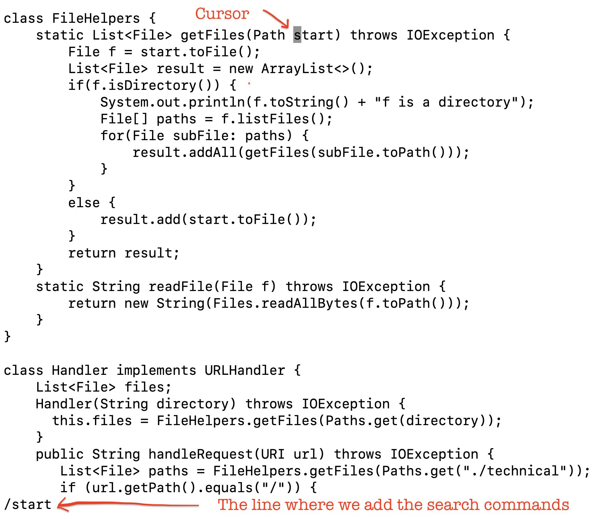
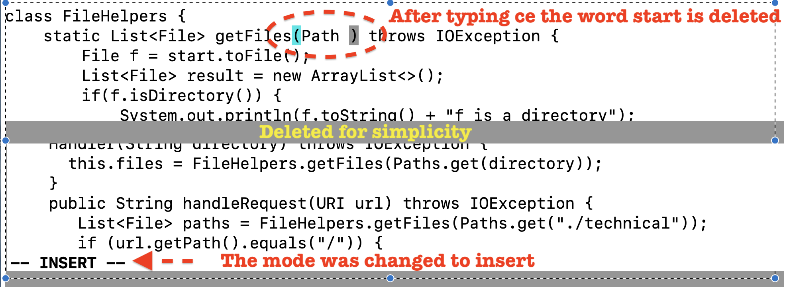
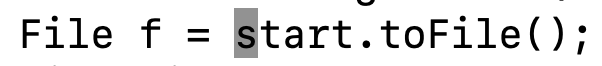

# Lab Report Week 7
*Vasilii Nikonov A15104557*

## Part 1

- Changing the name of the `start` parameter and its uses to `base`

We used the following commands:
```
/ s t a r t <enter> c e b a s e <esc> n . n . : w q
```
First we search for the string using `/`, that starts with `start`. 

 Then we use the command `c e` to change to the end of the word. This effectively replaces start with base, new name we type afterwords. 
 
 Press `<esc>` key to exit from the insert mode back to the command mode. 
 Within the command mode `n` will get us to the next instance of start (have to do so, because variable is used throughout the mode and we want to edit the file without breaking the functionality of the code). 
 
 
 Press `.` to effectively repeat the last changing commad. In our case it is the `c e b a s e`. 
 

 *Note I use spaces just for clarity, and not denoting the `<space>` button*. Press `:` to start typing the commad, `w` to save the file, `q` to exit the file.


**Total Nmber of keystrokes: 21**

## Part 2

It took me exactly 40 seconds to edit the `DocSearchServer.java` (simple start to base change), copy it to the remote and run it there. It was fast, because I already have a `cs15` shortcut command, that I used during the lab 1 report. 

Directly on the remote server it took me 30 seconds to edit the file and run it. The main difficulty was approx 0.5 second lag from the time I touched the keyboard, untill I actually saw the difference on the screen.

*Which of these two styles would you prefer using if you had to work on a program that you were running remotely, and why?*

I would prefer to edit the file locally, and only then transfer it to the remote server with the `scp` command. I choose so, because locally my vs code os set up in the way, that is comfortable. I have a dark theme, I have hints with the names of the variables I am about to type. Variables are highlighted in a certain color, as well as the class names. When I use vim, it is a plant black and white editor, and it is hard for myself to navugate throughout the file even with the great commands like `/someString`.

*What about the project or task might factor into your decision one way or another? (If nothing would affect your decision, say so and why!)*

Lets say I work on the project, where it is proximibed by license to "download" the code to some local machine. So I have no option, but to use the vim on the remote server. Though, we can also use the `nano` editor, which is also installed on every linux machine. I still like the idea of vim, it has an extreme learning curve, but once you are used to it - Vim can save a lot of time.


## Extra Work
- Adding a new line to print before `File[] paths = f.listfiles()`

We used the following commands:
```
/ <shift> s y s <enter> <shift> v y / <shift> f i l e [ <shift> O esp / <shift> miss <enter> <shift> c f . t o S t r i n g <shift> 9 <shift> 0 + <shift> ' f <space> i s <space> a <space> d i r e c t o r y <shift> ' ; <ecp> : w q";
```
Key moments:
- If I want to type capital `V` , I write `shift v`.
- Using the sequence `shift v y p` to yank and paste the whole lines
**Total Nmber of keystrokes: 65** (so many, because I have to type some words, I minimyzed the typing already by copying the `System.out.println` from the different part of the code).

Actually exactly after this commands I get the different output, when running the `java DocSearchServer.java` command

```
javac DocSearchServer.java
java DocSearchServer 4000
./technicalf is a directory
./technical/governmentf is a directory
./technical/government/About_LSCf is a directory
./technical/government/Env_Prot_Agenf is a directory
./technical/government/Alcohol_Problemsf is a directory
./technical/government/Gen_Account_Officef is a directory
./technical/government/Post_Rate_Commf is a directory
./technical/government/Mediaf is a directory
./technical/plosf is a directory
./technical/biomedf is a directory
./technical/911reportf is a directory
Server Started! Visit http://localhost:4000 to visit.
```
- 