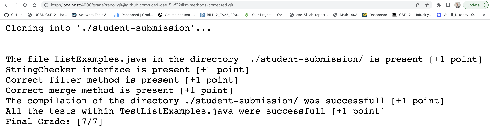
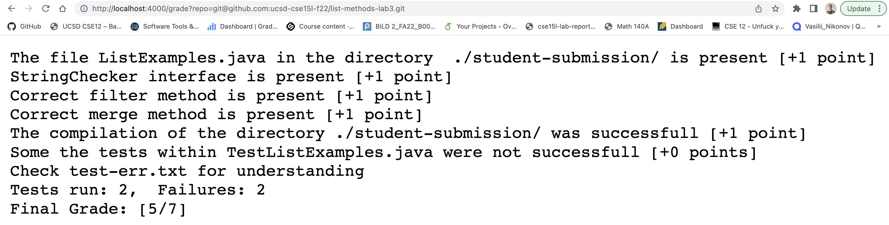
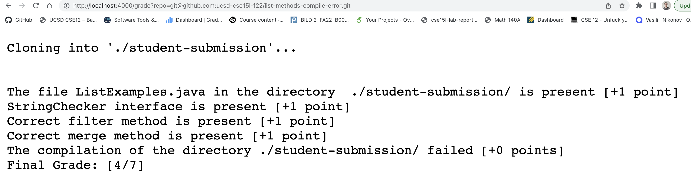
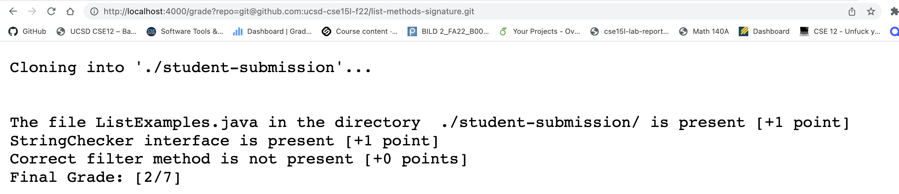

# Lab Report Week 7
*Vasilii Nikonov A15104557*

Below I add the contents of `grade.sh` as a code block

```
# Create your grading script here
# set -e
DIRNAME="./student-submission/"

rm -rf $DIRNAME
git clone $1 $DIRNAME

echo -e "\n"

score=0
MUSTFILE="ListExamples.java"
MAXIMUMCREDIT=5
SOURCETEST="TestListExamples.java"
SOURCETESTEXEC="TestListExamples"
## note here we use .. to go up one level to reach the lib folder
CPATH=".:../lib/hamcrest-core-1.3.jar:../lib/junit-4.13.2.jar"

# Checking the existance of the file
if [ -f $DIRNAME$MUSTFILE ]
then
    echo -e "The file" $MUSTFILE "in the directory " $DIRNAME "is present [+1 point]"
    ((score++))
else 
    echo -e "The file" $MUSTFILE "in the directory " $DIRNAME "is not present [+0 points]"
    echo "Final Grade: [$score/7]"
    exit
fi

STRINGCHECKER="interface\sStringChecker"

grep -E $STRINGCHECKER $DIRNAME$MUSTFILE > test-err.txt 2> test-err.txt
# check if the StringChecker Interface is present
if [ $? -eq 0 ]
then
    echo "StringChecker interface is present [+1 point]"
    ((score++))
else
    echo "StringChecker interface is not present [+0 points]"
    echo "Final Grade: [$score/7]"
    exit
fi

FILTERREGEXP='static\sList<String>\sfilter\(List<String>\s.*,\sStringChecker\s.*\)'
grep -E $FILTERREGEXP $DIRNAME$MUSTFILE > test-err.txt 2> test-err.txt
# check if correct filter method is present
if [ $? -eq 0 ]
then
    echo "Correct filter method is present [+1 point]"
    ((score++))
else
    echo -e "Correct filter method is not present [+0 points]"
    echo "Final Grade: [$score/7]"
    exit
fi

MERGEREGEXP='static\sList<String>\smerge\(List<String>\s.*,\sList<String>\s.*\)'
grep -E $MERGEREGEXP $DIRNAME$MUSTFILE > test-err.txt 2> test-err.txt
# check if correct merge method is present
if [ $? -eq 0 ]
then
    echo "Correct merge method is present [+1 point]"
    ((score++))
else
    echo -e "Correct merge method is not present [+0 points]"
    echo "Final Grade: [$score/7]"
    exit
fi

cp $SOURCETEST $DIRNAME
cd $DIRNAME
javac -cp $CPATH *.java 2> compile-err.txt

# Checking the compilation of the file
if [ $? -eq 0 ]
then
    echo "The compilation of the directory" $DIRNAME "was successfull [+1 point]"
    ((score++))
else 
    echo "The compilation of the directory" $DIRNAME "failed [+0 points]"
    echo "Final Grade: [$score/7]"
    exit
fi

java -cp $CPATH org.junit.runner.JUnitCore $SOURCETESTEXEC > test-err.txt

# Checking the correctness of the file
if [ $? -eq 0 ]
then
    echo "All the tests within" $SOURCETEST "were successfull [+1 point]"
    # as we have 2 tests
    ((score=score+2))
else 
    echo "Some the tests within" $SOURCETEST "were not successfull [+0 points]"
    echo "Check test-err.txt for understanding"
    grep -h "Failures" test-err.txt
fi

echo "Final Grade: [$score/7]"

```

Also I created the test using the `(timeout = 1000)` preventing the infinite loops.

Below I will show that after starting the server on port 4000 with the command `java GradeServer 4000`

The repository `git@github.com:ucsd-cse15l-f22/list-methods-corrected.git`, provides prefect ouput as I pass it as an attribute grade within the path.


The repository `git@github.com:ucsd-cse15l-f22/list-methods-lab3.git`, gets the score 5/7, because the test fails, it has the infinite loop. It is the initial version.


The repository `git@github.com:ucsd-cse15l-f22/list-methods-compile-error.git`, gets the score 4/7, because the compilation fails, code misses a semicolon.

Analyze the `repo=git@github.com:ucsd-cse15l-f22/list-methods-signature.git`

Lines run, they remove the current contents and clone the provided repository inside the folder `"./student-submission/"` 
```
rm -rf $DIRNAME
git clone $1 $DIRNAME
```

Their output is the message `Clonning...`

Line `if [ -f $DIRNAME$MUSTFILE ]` runs, it looks for the MUSTFILE `ListExamples.java`

As it is found, we provide the output `The file ListExamples.java in the directory  ./student-submission/ is present [+1 point]`
because we get a true statement within the `if` loops, otherwise we would print the final score and exit early

Line `grep -E $STRINGCHECKER $DIRNAME$MUSTFILE > test-err.txt 2> test-err.txt`
Looks for a String `interface StringChecker` within the fikse `ListExamples.java` within the dedicated folder, as this interface is required.
The standart output is the matching line from the file. But I created a special `file test-err.txt`, where all the output is redirected.
I get the message `StringChecker interface is present [+1 point]`, becuse we get a true value within the if statement, otherwise we would give the final score and exit from the code early.

Line `grep -E $FILTERREGEXP $DIRNAME$MUSTFILE > test-err.txt 2> test-err.txt` looks for a 
matching filter method with two parameters of type `StringChecker` and `List<String>`, we use the option `-E` for `grep` command, because of regular expressions.
The standart output is the matching line from the file. But I created a special `file test-err.txt`, where all the output is redirected.
As the source code has filter method types in the wrong order, the regular expression fails, and thus, the if statement evaluates as false.
The exit code from grep is not 0, so we execute the line `echo -e "Correct filter method is not present [+0 points]"` print the final score a nd exit the code early.


